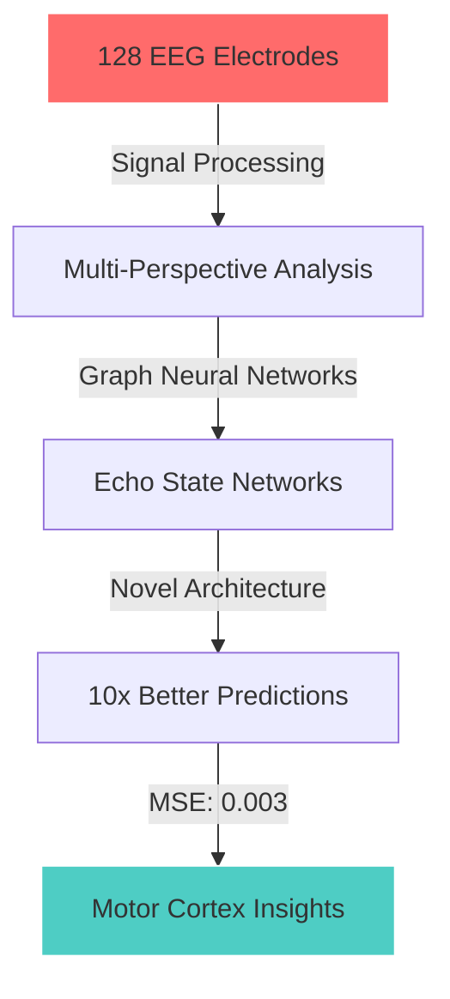

<div align="center">

```ascii
██████╗ ██████╗  █████╗ ██╗███╗   ██╗    ██╗    ██╗ █████╗ ██╗   ██╗███████╗███████╗
██╔══██╗██╔══██╗██╔══██╗██║████╗  ██║    ██║    ██║██╔══██╗██║   ██║██╔════╝██╔════╝
██████╔╝██████╔╝███████║██║██╔██╗ ██║    ██║ █╗ ██║███████║██║   ██║█████╗  ███████╗
██╔══██╗██╔══██╗██╔══██║██║██║╚██╗██║    ██║███╗██║██╔══██║╚██╗ ██╔╝██╔══╝  ╚════██║
██████╔╝██║  ██║██║  ██║██║██║ ╚████║    ╚███╔███╔╝██║  ██║ ╚████╔╝ ███████╗███████║
╚═════╝ ╚═╝  ╚═╝╚═╝  ╚═╝╚═╝╚═╝  ╚═══╝     ╚══╝╚══╝ ╚═╝  ╚═╝  ╚═══╝  ╚══════╝╚══════╝
```


</div>

<br>

<div align="center">
  
</div>

---

```python
#!/usr/bin/env python3
# -*- coding: utf-8 -*-

"""
INITIALIZATION SEQUENCE: KRISHNAN VENKITESWARAN
Loading neural pathways... ████████████████████████ 100%
"""

import torch
from transformers import OpenSourceContributor
from research import NeuralSignalProcessor
from hackathons import SerialWinner

class TheNeuralArchitect:
    """
    🧠 Where biological neural networks meet artificial intelligence
    """
    
    def __init__(self):
        self.identity = {
            'name': 'Krishnan Venkiteswaran',
            'education': 'B.E. AI/ML @ SIES GST (8.62/10)',
            'mission': 'Decode consciousness, one neuron at a time',
            'email': 'Krishnanvignesh148@gmail.com'
        }
        
        self.open_source_impact = {
            'organization': 'Hugging Face 🤗',
            'role': 'Open Source Contributor',
            'users_impacted': 100_000,
            'contributions': [
                'Fixed NanoVLM training convergence',
                'Optimized multi-GPU scaling performance'
            ]
        }
        
        self.research_breakthroughs = {
            'neural_dynamics': {
                'title': 'Multi-Perspective Graph ESN',
                'accuracy_improvement': '10x',
                'status': 'Accepted @ SFN 2025',
                'mse': 0.003  # vs 0.030 for standard models
            }
        }
        
    def decode_brain_signals(self):
        """Transform 128 electrode arrays into the future of AI"""
        return "🧠 ➜ 🤖 ➜ 🚀"

# Initialize the architect
architect = TheNeuralArchitect()
print(f"System online. Impact radius: {architect.open_source_impact['users_impacted']:,} developers")
```

---

<h2 align="center">
  
  THE NEURAL LABORATORY
  
</h2>

<table>
<tr>
<td width="33%" valign="top">

### 🧬 Project Alpha
**GRAPH-ESN NEURAL DYNAMICS**



**📊 Stats That Matter:**
- 5GB neural recordings processed
- 10x accuracy improvement
- Accepted @ SFN 2025

</td>
<td width="33%" valign="top">

### 🎤 Project Beta
**AUDIHEALTH DIAGNOSTICS**

```
┌──────────────────────┐
│ Voice Sample Input   │
│         ↓            │
│   BiLSTM Analysis    │
│         ↓            │
│  94% Accuracy Output │
│         ↓            │
│ WhatsApp Integration │
└──────────────────────┘
```

**🏥 Impact Metrics:**
- 6,000 voice samples
- 4 disorders detected
- Real-time monitoring
- AI-powered reports

</td>
<td width="33%" valign="top">

### 💰 Project Gamma
**FINSAATHI PLATFORM**

```python
def democratize_finance():
    """
    RAG + LLaMA 3.2 + 
    Monte Carlo = 
    Financial Inclusion
    """
    return "🏆 Datathon Winner"
```

**🚀 Tech Arsenal:**
- Sentence-BERT embeddings
- ChromaDB vectors
- FastAPI backend
- PostgreSQL storage

</td>
</tr>
</table>

---

<div align="center">

## ⚔️ BATTLE RECORD ⚔️

```
╔════════════════════════════════════════════════════════════════════════╗
║                         HACKATHON DOMINATION                           ║
╠════════════════════════════════════════════════════════════════════════╣
║  🏆 The Great Bengaluru Hackathon ········· CHAMPION (16,000 warriors) ║
║  🥇 HackTU 6.0 @ TIET Patiala ············ VICTOR (7,000 competitors)  ║
║  🎯 Datathon '24 @ KJ Somaiya ············· WINNER (2,000 data minds)  ║
║  ⚡ Technical Excellence Award ············· SIES GST Recognition      ║
║  🔥 Techsparks '24 @ FCRIT ················ CONQUERED (500 hackers)    ║
║  🥈 NSC-ETT @ TCET ························ RUNNER-UP (1,000 entries)  ║
║  🏅 Devshouse '24 @ VIT ··················· 14th/3,500 Nationally      ║
║  👑 Cognition @ SIES ······················ 3X CONSECUTIVE CHAMPION    ║
╚════════════════════════════════════════════════════════════════════════╝
```

</div>

---

<h2 align="center">🛠️ WEAPON SYSTEMS</h2>

<div align="center">

| Core Arsenal | Neural Weapons | Signal Processing |
|:------------:|:--------------:|:-----------------:|
|  |  |  |
|  |  |  |

**🧪 Specialized Tech:** Graph Neural Networks • Echo State Networks • VAEs • GANs • Diffusion Models • Liquid State Machines

</div>

---

<div align="center">

## 📚 PUBLISHED WORKS


| 📖 Title | 🎯 Venue | 📊 Impact |
|:---------|:---------|:----------|
| **How Minds Take Shape: Graph-ESN Neural Dynamics** | SFN 2025 *(Accepted)* | 🧠 Breakthrough in neural understanding |
| **AI-Driven Recruitment through Personality Prediction** | IDEA 2024, Springer | 📈 87% accuracy |
| **Advanced Fake News Detection Using BERT** | ICDSM 2024, Springer | 🎯 92.3% accuracy |
| **Neuro-Symbolic AI for Medical Diagnosis** | ICICN 2024, Springer | 🏥 Healthcare innovation |

</div>

---

<h2 align="center">📡 REAL-TIME STATS</h2>

<div align="center">
  
</div>

<div align="center">
  
</div>

---

<div align="center">

## 🌊 CURRENT EXPERIMENTS

```javascript
class CurrentMission {
    constructor() {
        this.activeProjects = [
            {
                name: "🧠 Consciousness Decoder",
                description: "Multi-Perspective Graph ESN for neural ensemble dynamics",
                progress: "████████████████░░░░ 80%",
                impact: "Redefining how we understand brain computation"
            },
            {
                name: "🤗 Hugging Face Contributions",
                description: "Democratizing AI through open source",
                progress: "████████████████████ 100%",
                impact: "100,000+ developers enabled"
            },
        ];
    }
    
    getNextTarget() {
        return "Bridge the gap between biological and artificial intelligence";
    }
}
```

</div>

---

<div align="center">

## 🤝 INITIATE CONTACT

<p align="center">
  <a href="https://www.linkedin.com/in/krishnan-vignesh-709aba229/">
    
  </a>
</p>

<p align="center">
  <a href="mailto:Krishnanvignesh148@gmail.com">
    
  </a>
</p>

<p align="center">
  <a href="https://github.com/Krish0909">
    
  </a>
</p>

<br>

```ascii
╔═══════════════════════════════════════════════════════════════════╗
║  "The brain is the universe's most sophisticated computer.        ║
║   I'm just trying to write better software for it."               ║
║                                                                   ║
║                              - Krishnan Venkiteswaran             ║
╚═══════════════════════════════════════════════════════════════════╝
```


<br><br>


</div>
