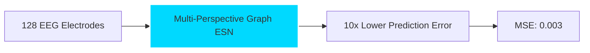

# 🧠 Neural Pathways to Innovation

<div align="center">
  
  [](https://git.io/typing-svg)
  
  
  
  [](https://www.linkedin.com/in/krishnan-venkiteswaran)
  [](mailto:Krishnanvignesh148@gmail.com)
  [](https://github.com/Krish0909)
  
</div>

## 🌊 About the Neural Explorer

```python
class NeuralArchitect:
    def __init__(self):
        self.current_role = "ML Engineer @ Hugging Face 🤗"
        self.education = "B.E. AI & ML @ SIES GST (GPA: 8.62/10)"
        self.research_interests = [
            "Neural Signal Processing 🧠",
            "Graph Neural Networks 🕸️",
            "Biomedical ML 🏥",
            "Echo State Networks 🌊"
        ]
        self.current_obsession = "How minds engineer stable representations"
    
    def decode_neural_patterns(self):
        return "Transforming brain signals into computational insights"
```

## 🚀 Open Source Impact

<div align="center">
  
### 🤗 Hugging Face Contributions
  
| 🎯 Achievement | 💡 Impact |
|----------------|-----------|
| Fixed NanoVLM Training Logic | Enabled stable convergence for vision-language models |
| Resolved GPU Scaling Issues | Improved performance for **100k+ users** |

</div>

## 🧪 Research Laboratory

<details>
<summary><b>🧠 How Minds Take Shape: Graph-ESN Neural Dynamics</b> <i>(Click to expand)</i></summary>



- 📊 **Novel MP-GESN Architecture**: Achieved unprecedented accuracy in neural ensemble dynamics prediction
- 🔬 **Data Scale**: Analyzed 5GB of EEG, ECoG, and LFP recordings
- 🎯 **Key Discovery**: Unveiled stable representation mechanisms in motor cortex
- 📝 **Status**: Under review at NeurIPS 2025

</details>

<details>
<summary><b>🎤 AudiHealth: Voice as a Biomarker</b> <i>(Click to expand)</i></summary>

- 🎯 **94% Accuracy** in detecting 4 major voice disorders
- 📊 **6,000 Voice Samples** analyzed and processed
- 🤖 **AI-Powered Reports** using DeepSeek-R1 and clinical NLP
- 📱 **WhatsApp Integration** for continuous patient monitoring

</details>

<details>
<summary><b>💰 FinSaathi: Democratizing Financial Access</b> <i>(Datathon '24 Winner)</i></summary>

- 🏆 **Winner among 2,000 participants**
- 🔍 **RAG-based Scheme Matching** across government programs
- 📈 **Monte Carlo Simulations** for risk assessment
- 🚀 **Tech Stack**: LLaMA 3.2, ChromaDB, FastAPI

</details>

## 🏆 Achievement Neural Network

<div align="center">

```
        🥇 Great Bengaluru Hackathon (16,000 participants)
       /  \
      /    \
    🥇      🥇
HackTU 6.0  Datathon'24
(7,000)     (2,000)
    |         |
    🏅--------🏅
Technical Excellence Award
```

### 📊 Competitive Programming Stats
- **7x Hackathon Winner** 🏆
- **4 Research Papers Published** 📚
- **100k+ Lives Impacted** through open source 🌍

</div>

## 🛠️ Neural Toolkit

<div align="center">

### Core Technologies


### Specialized Arsenal


</div>

## 📈 GitHub Neural Activity

<div align="center">
  
</div>

## 🔮 Current Neural Experiments

- 🧠 Decoding consciousness through Graph-ESN architectures
- 🏥 Advancing pharmaceutical ML at the molecular level
- 🤗 Contributing to democratizing AI through Hugging Face
- 📊 Building bridges between neuroscience and machine learning

---

<div align="center">
  
  
  ### 💡 "The brain is the last and greatest frontier... most complicated thing we have yet discovered in our universe" - James Watson
  
  
</div>
