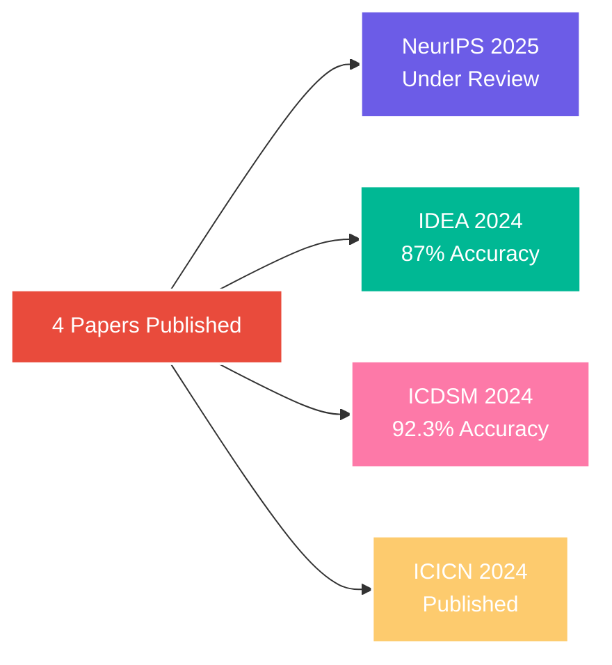

<!-- Dynamic Background -->


<!-- Animated Tagline -->
<p align="center">
  
</p>

<!-- Social Links with Hover Effect -->
<p align="center">
  <a href="https://www.linkedin.com/in/krishnan-vignesh-709aba229">
    
  </a>
  &nbsp;
  <a href="mailto:krishnanvignesh148@gmail.com">
    
  </a>
  &nbsp;
  <a href="https://github.com/Krish0909">
    
  </a>
  &nbsp;
  <a href="https://huggingface.co/Krish0909">
    
  </a>
</p>

<br/>

<!-- Metrics Dashboard -->
<div align="center">
  
  
  
  
</div>

<br/>

<!-- GitHub Stats Cards -->
<p align="center">
  
  
</p>

<br/>

<!-- Tech Stack Animation -->
<h2 align="center">
  
  Tech Arsenal
  
</h2>

<p align="center">
  
</p>

<details align="center">
<summary><b>🔬 Specialized Expertise</b></summary>
<br/>
<table>
<tr>
<td align="center" width="33%">
<h4>Neural Computing</h4>
<code>Graph Neural Networks</code><br/>
<code>Echo State Networks</code><br/>
<code>Brain-Computer Interfaces</code><br/>
<code>Signal Processing</code>
</td>
<td align="center" width="33%">
<h4>Advanced ML</h4>
<code>Transformers</code><br/>
<code>Diffusion Models</code><br/>
<code>RAG Systems</code><br/>
<code>Neural ODEs</code>
</td>
<td align="center" width="33%">
<h4>Production Systems</h4>
<code>Real-time Inference</code><br/>
<code>Distributed Training</code><br/>
<code>MLOps</code><br/>
<code>API Development</code>
</td>
</tr>
</table>
</details>

<br/>

<!-- Flagship Projects -->
<h2 align="center">🚀 Flagship Projects</h2>

<table>
<tr>
<td width="50%">
<h3 align="center">🧠 Multi-Perspective Graph ESN</h3>
<div align="center">
  
  
</div>

```python
class BrainSignalAnalyzer:
    def __init__(self):
        self.architecture = "Graph ESN + Auxiliary Learning"
        self.performance = {"mse": 0.003, "baseline": 0.03}
        self.scale = "128 electrodes, 5GB data"
    
    def breakthrough(self):
        return "First to combine GNN + ESN for neural dynamics"
```

**Impact:** Revolutionizing brain-computer interfaces with unprecedented accuracy in neural pattern prediction.
</td>
<td width="50%">
<h3 align="center">🎤 AudiHealth</h3>
<div align="center">
  
  
</div>

```python
class VoiceHealthAI:
    def __init__(self):
        self.model = "BiLSTM + Liquid State Machine"
        self.disorders = ["Dysphonia", "Laryngitis", "Paralysis", "Spasmodic"]
        self.deployment = "WhatsApp API + Cloud"
    
    def diagnose(self, voice_sample):
        return "Real-time pathology detection in <100ms"
```

**Impact:** Democratizing voice health diagnostics with instant AI-powered analysis accessible via WhatsApp.
</td>
</tr>
</table>

<br/>

<!-- Competition Wins -->
<h2 align="center">🏆 Championship Legacy</h2>

<div align="center">
  
| **Competition** | **Scale** | **Achievement** | **Year** |
|:---:|:---:|:---:|:---:|
| 🥇 **The Great Bengaluru Hackathon** | 16,000 participants | **Winner** | 2025 |
| 🥇 **HackTU 6.0 - Major League Hacking** | 7,000 participants | **Winner** | 2025 |
| 🥇 **Datathon 24 - KJ Somaiya** | 2,000 participants | **Winner** | 2025 |
| 🏅 **Technical Excellence Award** | SIES GST | **Recipient** | 2025 |

</div>

<br/>

<!-- Research Publications -->
<h2 align="center">📖 Published Research</h2>

<div align="center">



</div>

<br/>

<!-- Open Source Contribution -->
<h2 align="center">🌟 Open Source Impact</h2>

<div align="center">
  
  
  <br/><br/>
  
  **Key Contributions:**
  - 🔧 Fixed critical NanoVLM training convergence issues
  - ⚡ Resolved multi-GPU scaling bottlenecks
  - 🚀 Improved vision-language model stability for 100k+ users
</div>

<br/>

<!-- Contact CTA -->
<h2 align="center">💫 Let's Create Something Amazing</h2>

<div align="center">
  <p>
    <b>Currently exploring opportunities in Neural Computing, AI Research, and Healthcare ML</b>
  </p>
  
  <a href="mailto:krishnanvignesh148@gmail.com">
    
  </a>
  &nbsp;
  <a href="https://calendly.com/krishnanvignesh148">
    
  </a>
  &nbsp;
  <a href="https://linkedin.com/in/krishnan-vignesh-709aba229">
    
  </a>
</div>

<br/>

<!-- Activity Graph -->


<!-- Footer -->

