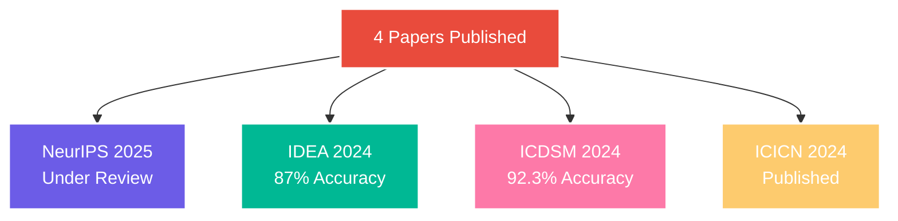

<!-- HEADER -->

  

<h2 align="center">Invent • Inspire • Impact</h2>

  <b>AI Researcher | Medical ML | Hackathon Winner | Open Source Enthusiast</b>

 

<!-- SOCIALS & CONTACT -->

  
  
  
  
  

 

<!-- SNAPSHOT METRICS -->

  
  
  
  

 

<!-- ABOUT ME -->

  
<b>👋 About Me</b>

   
  <ul>
    <li>🌟 Passionate about building robust AI systems and medical machine learning solutions</li>
    <li>🔬 Researcher with multiple publications in top AI and ML conferences</li>
    <li>🏅 Winner of national and international hackathons</li>
    <li>🧑‍💻 Contributor to Hugging Face Transformers and other open source ML projects</li>
    <li>🎓 Always learning, always sharing</li>
  </ul>

 

<!-- TECH STACK -->
<h2 align="center">🛠️ Tech Arsenal</h2>

  

<b>🔍 Specialized Skills</b>

 
<table>
<tr>
<td align="center" width="33%">
<h4>Neural Computing</h4>
<code>Graph Neural Networks</code> 
<code>Echo State Networks</code> 
<code>Brain-Computer Interfaces</code> 
<code>Signal Processing</code>
</td>
<td align="center" width="33%">
<h4>Advanced ML</h4>
<code>Transformers</code> 
<code>Diffusion Models</code> 
<code>Retrieval-Augmented Generation (RAG)</code> 
<code>Neural ODEs</code>
</td>
<td align="center" width="33%">
<h4>Production Systems</h4>
<code>Real-time Inference</code> 
<code>Distributed Training</code> 
<code>MLOps</code> 
<code>API Development</code>
</td>
</tr>
</table>

 

<!-- PROJECTS -->
<h2 align="center">🚀 Flagship Projects</h2>
<table>
<tr>
<td width="50%">
<h3 align="center">🧠 Multi-Perspective Graph ESN</h3>

  
  

 
Combining Graph Neural Networks & Echo State Networks, this project sets new standards in neural signal prediction for brain-computer interfaces.
</td>
<td width="50%">
<h3 align="center">🎤 AudiHealth</h3>

  
  

 
AI-powered voice pathology detection, accessible via WhatsApp. Democratizing rapid, reliable voice health diagnostics.
</td>
</tr>
</table>

 

<!-- ACHIEVEMENTS & COMPETITIONS -->
<h2 align="center">🏆 Championship Legacy</h2>

  
| Competition | Scale | Achievement | Year |
|:---:|:---:|:---:|:---:|
| 🥇 Great Bengaluru Hackathon | 16,000 | Winner | 2025 |
| 🥇 HackTU 6.0 (MLH) | 7,000 | Winner | 2025 |
| 🥇 Datathon 24 (KJ Somaiya) | 2,000 | Winner | 2025 |
| 🏅 Technical Excellence Award | SIES GST | Recipient | 2025 |

 

<!-- RESEARCH PUBLICATIONS -->
<h2 align="center">📖 Published Research</h2>

 
<!-- OPEN SOURCE IMPACT --> 
<h2 align="center">🌟 Open Source Impact</h2> 
     <b>Key Contributions:</b> <ul> <li>🛠️ Fixed critical NanoVLM training issues</li> <li>⚡ Improved multi-GPU scaling for vision-language models</li> <li>🚀 Enhanced model stability for 100k+ users</li> </ul> 
   <!-- FUN FACTS --> 
 
<b>🤫 Fun Facts About Me</b>
 <ul> <li>Can code neural nets faster than I solve a Rubik’s Cube!</li> <li>Loves sci-fi movies and fusion cuisine 🍜🚀</li> <li>Secretly building an AI music composer 🤖🎶</li> </ul> 
   <!-- CONTACT / CTA --> <h2 align="center">💫 Let's Build Something Amazing!</h2> 
 <b>Exploring opportunities in Neural Computing, AI Research, and Healthcare ML</b>       
   <!-- CONTRIBUTION GRAPH --> <h2 align="center">🔥 My GitHub Contribution Heatmap</h2>  <!-- FOOTER -->  
<i>“Invent, Inspire, Impact.”</i>
 
